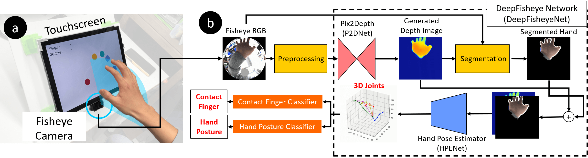

# DeepFisheye Network
This is a codebase for training and testing the DeepFisheye network. It is based on Python3 and Pytorch.
Our work, **'DeepFisheye: Near-Surface Multi-Finger Tracking Technology Using Fisheye Camera'**, was presented in UIST 2020.



Near-surface multi-finger tracking (NMFT) technology expands the input space of touchscreens by enabling novel interactions such as mid-air and finger-aware interactions. We present DeepFisheye, a practical NMFT solution for mobile devices, that utilizes a fisheye camera attached at the bottom of a touchscreen. DeepFisheye acquires the image of an interacting hand positioned above the touchscreen using the camera and employs deep learning to estimate the 3D position of each fingertip. Additionally, we created simple rule-based classifiers that estimate the contact finger and hand posture from DeepFisheye’s output.

## Related Links
- [Paper](https://dl.acm.org/doi/abs/10.1145/3379337.3415818)
- [Project page](http://kwpark.io/deepfisheye)
- [Dataset project page](https://github.com/KeunwooPark/DeepFisheyeDataset)
- [Pretrained model weight](https://drive.google.com/file/d/1C_kbaw1Ull4D_JHgDkhrLwdjCITzj-8E/view?usp=sharing)

## Short Explanations of the Folders

|Folder Name|What is it?|
|-------------|-------------|
|dataset | Dataloaders and file pathes of datasets.|
|model | Network models. A model contains a network, an optimizer. |
| +- pipeline | A pipeline connects multiple models into one.|
|network | Actual deep learning networks.|
|options | Options for models and pipelines. |
|preset| A preset is a set of predefined options.|
|run| A run contains actual training or testing logic.|
|scripts| Scripts for running train and test.|
|results (will be created dynamically)| All the results goes into here.|
|util| Useful functions. |
|```train.py``` and ```test.py``` | Main function of the training and testing process. You do not have touch these files.|


## Quick Start: How to Train and Test
### 1. Install the requirements.

```shell
$ pip install -r requirements.txt
```

### 2. Download and Unzip a Dataset.

There are two datasets. One is *synthetic* datset and the other one is *real* dataset. It is possible to run train and test with only one dataset. Please visit the [dataset project page](https://github.com/KeunwooPark/DeepFisheyeDataset) to download the datasets. Then, unzip the dataset file wherever you want to.


### 3. Import a Dataset.

Importing a dataset means creating a text file that holds file paths of the dataset. For example, you can import sythetic dataset by running the script below. You have to put the root directory of the dataset.

```shell
$ python dataset/import_data.py --data_type synth --data_dir root/path/of/dataset --test_ratio 0.2
```

Then two text files are created under a directory with the name of the dataset type (e.g. synth, real).

### 4. Run Training

There are three steps of training in our paper. You have to run a corresponding script for each steps. If you want to use [tensorboard](https://www.tensorflow.org/tensorboard), then run ```run_board.sh``` before running a script.

A script with ```_local``` postfix is for testing. It runs with very small size dataset. If you have a local computer with small GPU and want to run main training on a large GPU server, then use a local script to test in your local computer before running a training on the server.

1. Create a directory for saving trained models (e.g. trained_models).
2. Run ```pix2depth/train_pix2depth.sh```. **Change parameters for your hardware environment (e.g. batch_size, gpu_ids).**
3. Choose the weight file (```*.pth.tar```) of Pix2Depth network that you want to use for the next step, and move the file to ```trained_models```.
4. In the ```pipeline.train_pipeline_synth.sh```, set ```--p2d_pretrained``` parameter to the location of the weight file.
5. Choose and move the weight file of the pipeline as Step 3.
6. In the ```pipeline.train_pipeline_real.sh```, set ```--pipeline_pretrained``` parameter to the location of the trained pipeline's weight file.

### (5. Run Testing)

You can run test for each trained models with ```test_*.sh``` scripts. All you have to do is set ```--*_pretrained``` parameter correctly.

## Using the pretrained model
You can use the pretrained model that we used in our paper.
1. Download the model weight file from [here](https://drive.google.com/file/d/1C_kbaw1Ull4D_JHgDkhrLwdjCITzj-8E/view?usp=sharing).
2. Set ```pipeline_pretrained``` parameter in the option to the location of the downloaded weight file.
3. Create the pipeline.

## FAQ

### Is the real dataset same as the dataset used for user testing in the paper?
No. Data used in the user tests are different from the real dataset. We used real dataset only for the training. We cannot share to actual test data because of privacy issues.

### Can I create a virtual fisheye camera?
Please check out [fisheye camera mesh generator](https://github.com/KeunwooPark/fisheye_mesh_generator).

# Contact
- [Keunwoo Park](http://kwpark.io)

# Citation
Please cite our paper in your publication if it helped your research.

```
@inproceedings{Park2020DeepFisheye,
author = {Park, Keunwoo and Kim, Sunbum and Yoon, Youngwoo and Kim, Tae-Kyun and Lee, Geehyuk},
title = {DeepFisheye: Near-Surface Multi-Finger Tracking Technology Using Fisheye Camera},
year = {2020},
isbn = {9781450375146},
publisher = {Association for Computing Machinery},
address = {New York, NY, USA},
url = {https://doi.org/10.1145/3379337.3415818},
doi = {10.1145/3379337.3415818},
booktitle = {Proceedings of the 33rd Annual ACM Symposium on User Interface Software and Technology},
pages = {1132–1146},
numpages = {15},
keywords = {near-surface, deep learning, touchscreen, computer vision, finger tracking},
location = {Virtual Event, USA},
series = {UIST '20}
}
```

# Acknowledgments
Our code is inspired by [cyclegan](https://github.com/junyanz/pytorch-CycleGAN-and-pix2pix).
